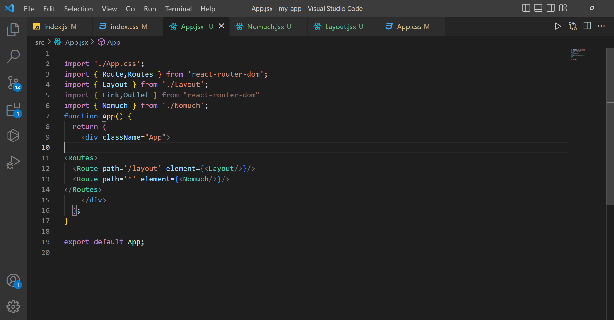

# Routing with react router
## A router is hardware 
## device designed to 
## receive, analyse and 
## move incoming packets 
## to another network.

### Routing with react 
### router 

# First we install it 

# Second we configure 

# Third in App.jsx we put our Router
# And put controls in it 

